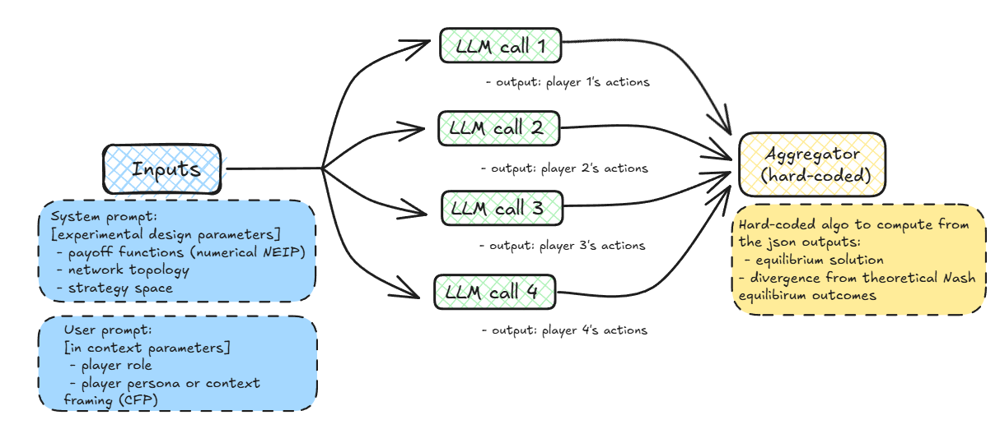

# LLM_network_games

Strategic Reasoning of LLM-Based Agents in Network Game Environments

This repository contains a small experiment exploring how LLMs converge or not to the Nash equilibrium in a simple network coordination game (strategic complements).  The code lets you run players backed by different LLM providers and aggregate the resulting play distributions.

## Setup

1. **Install dependencies**
   ```bash
   pip install -r requirements.txt
   ```
   You will also need the SDKs for any providers you wish to use (`openai`, `anthropic`, `mistral`, etc.).

2. **API keys**
   Create a `.env` file in the repository root containing the API keys for the models you intend to call:
   ```
   OPENAI_API_KEY=...
   GEMINI_API_KEY=...
   ANTHROPIC_API_KEY=...
   MISTRAL_API_KEY=...
   ```


## Running the coordination game

The main driver for the coordination game is [`src/coordination_game/line_network.py`](src/coordination_game/line_network.py).  A typical call looks like:

```bash
python line_network.py --players 1 2 3 4 --costs 0.5 1 2 \
    --experiment_id 1 --provider openai --cfp min --neip baseline
```

Results are written to `tests/<provider>/results_<id>.json`.


### Workflow overview



Visualization utilities are provided:

- [`aggregator.py`](src/coordination_game/aggregator.py) collects the profile/equilibirum distributions from the result files.
- [`heatmap_equilibria.py`](src/coordination_game/heatmap_equilibria.py) plots a heatmap of the Nash equilibrium probability across models, costs and Context Framing Perturbations (CFP).


## Repository layout

```
src/                    python modules and scripts
  LLM_clients/          wrappers for OpenAI, Gemini, Anthropic and Mistral APIs
  coordination_game/    coordination game driver and analysis tools
tests/                  sample result files for the coordination game
experiment1.sh/         run Monte Carlo simulations for the coordination game
```

---